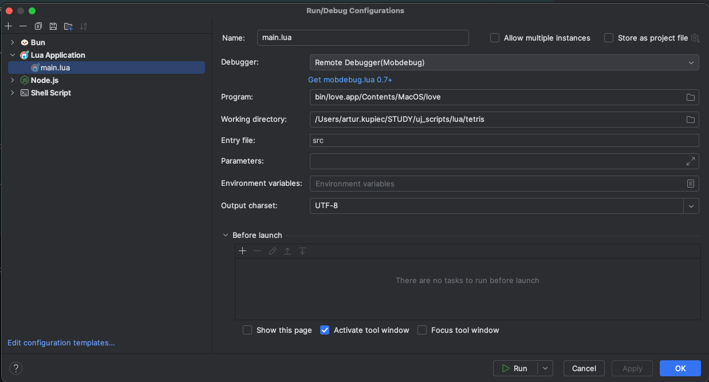

# dev setup
setup for lua & love api is not so simple from my perspective therefore I provide only my current MacOS setup

## Theoretical requirements

1. Lua `brew install lua`
2. Download [love2d](https://github.com/love2d/love/releases/download/11.5/love-11.5-macos.zip)

## MacOS

1. jetbrains IDE install [EmmyLua plugin from marketplace](https://plugins.jetbrains.com/plugin/9768-emmylua/)
2. run shell script that will install love & love-api in correct places
```shell

  mkdir -p bin
  cd bin

  #lua
  brew install lua

  #love
  curl -L https://github.com/love2d/love/releases/download/11.5/love-11.5-macos.zip > love.zip
  unzip love.zip
  rm love.zip

```
3. create run script **!!!!WARNING!!!!** Entry file should be directory




# todo

1. helloworld
2. setup
3. runtime
